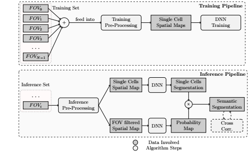
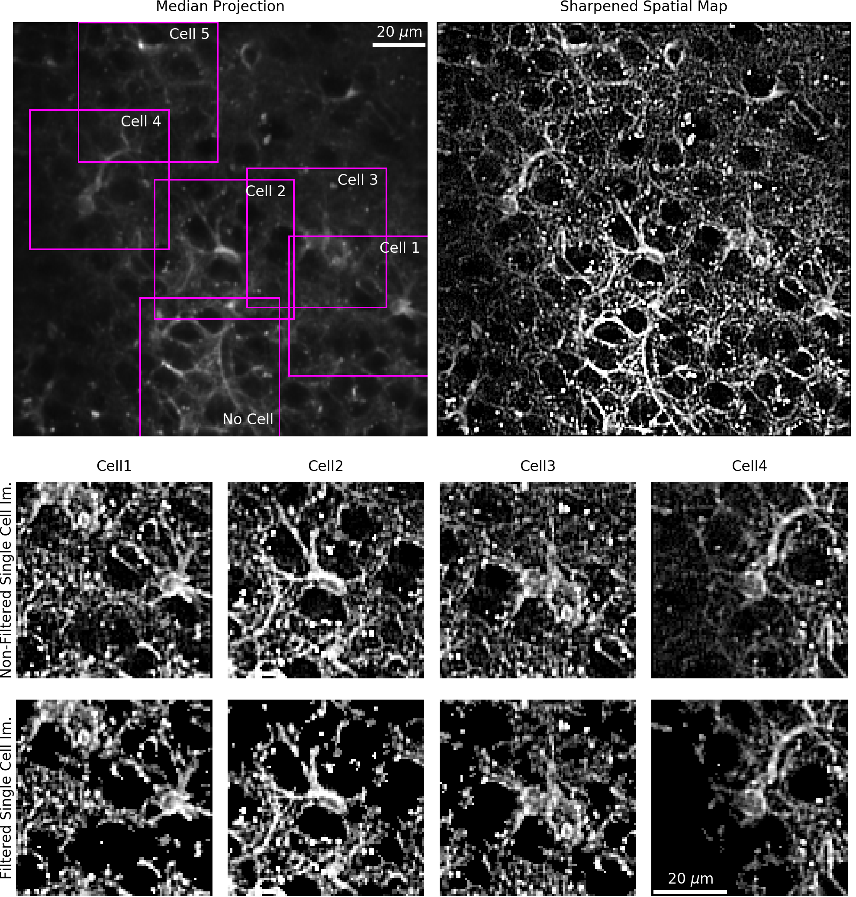
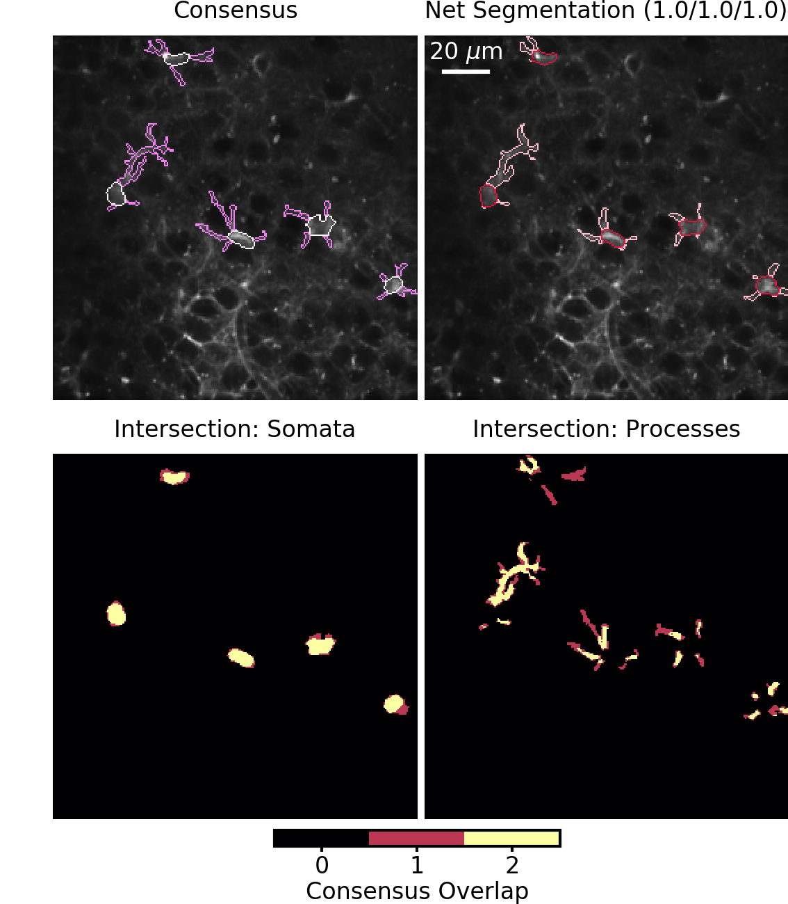
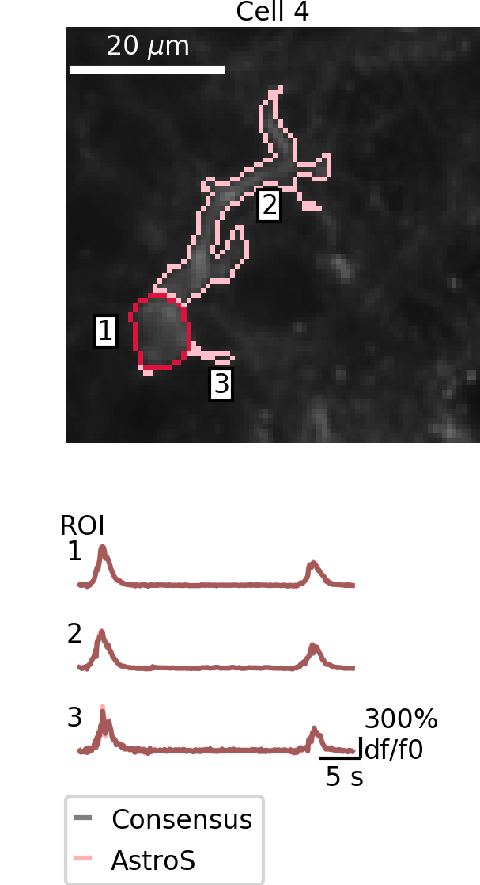
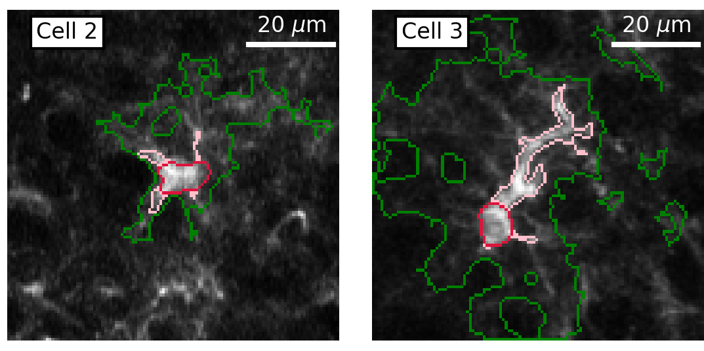

# Astrocyte Segmentation Project
We developed Astro3S, a novel software for astrocyte spatiotemporal semantic segmentation, which combines deep learning algorithms
with features engineering of calcium data and operates without human intervention. Astro3S performs fast and precise identification 
of astrocytic cell somata, processes, and cellular domains showing correlated calcium dynamic. 

## Astro3S: Astrocyte Spatiotemporal Semantic Segmentation using machine learning techniques
Astro3S is a software that employs a combination of supervised and unsupervised techniques providing a fully automatic pipeline for 
the analysis spatiotemporal information of brain astrocytes. This software is composed by 2 pipelines named training and inference.

During training pipeline Astro3S hyperparameters are optimized on the training set pre-processed. Thanks to this optimization we removed any 
human supervision from Astro3S inference pipeline.The inference pipeline comprises three main blocks - pre-processing, semantic segmentation, 
and subcellular cross-correlation analysis - allowing an unbiased end-to-end characterization of the complex morphological and dynamical properties of astrocytes.  

### Pre-processing modules results

### Segmentation Results
| Semantic Segmentation      | Details of a single cell      | 
|------------|-------------| 
|   |   |

### Cross Correlation analysis Results

This code has been developed with Python 3.6.7, Pytorch 1.1 with CUDA 10.1. All the packages are listed in the requirements.txt

## Installer
Installer can be used to install all the fundamental packages used in AstroSS if python 3.6.7 is already installed. If you need to
install python run:

- sudo apt update
- sudo apt-get install python3.6
- sudo apt install python3-pip

With file gpu_setup1.sh in folder installation, cuda packages will be downloaded and installed
With file set_up2 all the necessary python packages will be installed and a virtual environment will be set-up

## Nvidia-Docker (recommended) 
We have written a Dockerfile to use our software on nvida-docker and skip the manual installation of each package. 
- Install nvidia-docker if you have not installed it on your machine. Follow instructions at https://github.com/NVIDIA/nvidia-docker
- docker pull nvidia/cuda:10.1-runtime-ubuntu18.04
- run docker -t astro_segm:1.0 build . 

## Notebook

In this folder there are:

- Set_parameters: in this notebook it is described how to set all the hyperparameters of Astro3S using the training set 
- Training_Pipeline_PP: in this notebook it is described how to perform the preprocessing of training pipeline in Astro3S
- Training_Pipeline_Training_DNN: in this notebook it is described how to train the DNN
- Inference_Pipeline: In this notebook it is described how to perform AstroSS inference on the inference dataset
- CC_Pipeline

## Astro3S

### modules

- The modules used in Training and Inference pipelines are embedded in the libraries (.py files) 
- In model folder there is the DNN developed and used for benchmarking

### pipelines
In this folder there are pipelines used to perform experiments described in the paper 

## Zip_mask

- GT:In this folder there are the consunsus manual annotations of each dataset
- User_1: in this folder there are the Annotator-1 manual annotations of each dataset
- User_2: in this folder there are the Annotator-2 manual annotations of each dataset
- User_3:in this folder there are the Annotator-3 manual annotations of each dataset

## set 
In this folder there is the script to download each dataset and organize datasets in different folders

## weights
In this folder There is a scripts that can be used to download DNN weights used for benchmarking Astro3S
