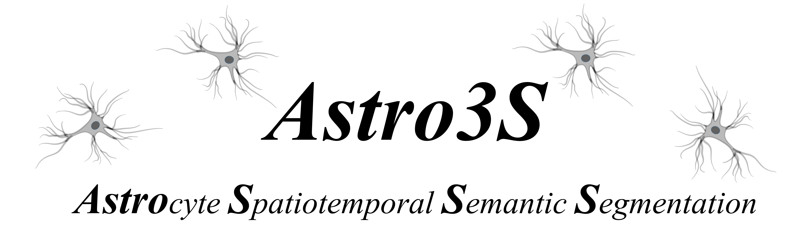
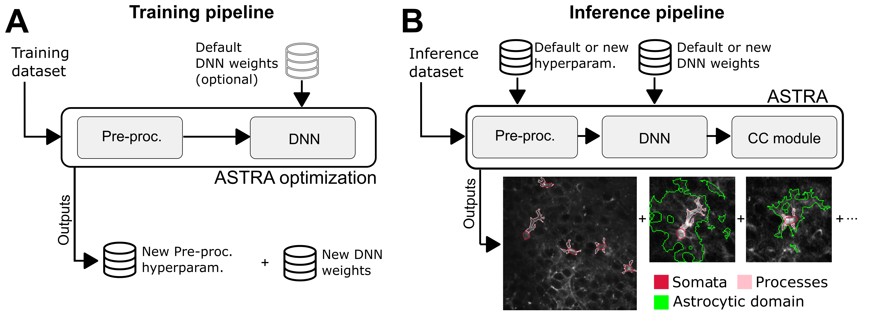

ASTRA, a novel software for astrocyte spatiotemporal semantic segmentation, combines deep learning algorithms
with features engineering of calcium data and operates without human intervention. ASTRA performs fast and precise identification 
of astrocytic cell somata, processes, and cellular domains showing correlated calcium dynamic. 

## ASTRA: Astrocyte Spatiotemporal Semantic Segmentation using machine learning techniques
ASTRA is a software that employs a combination of supervised and unsupervised techniques providing a fully automatic pipeline for 
the analysis spatiotemporal information of brain astrocytes. This software is composed by 2 pipelines named training and inference.

During training pipeline ASTRA hyperparameters are optimized on the training set pre-processed. Thanks to this optimization we removed any 
human supervision from ASTRA inference pipeline.The inference pipeline comprises three main blocks - pre-processing, semantic segmentation, 
and subcellular cross-correlation analysis - allowing an unbiased end-to-end characterization of the complex morphological and dynamical properties of astrocytes.  
<!--
### Pre-processing modules results

### Segmentation Results
| Semantic Segmentation      | 
|:------------:|
|   |

|Single cell Details|
|:------------------:|
|  
<!--
### Cross Correlation analysis Results

-->
This code has been developed with Python 3.6.7, Pytorch 1.1 with CUDA 10.1. All the packages are listed in the requirements.txt

**UPDATE** Dockerfile has been updated with python3.10, Pytorch 2.2 with CUDA 12.2. All the packages are listed in the requirements.txt

## Installer
Installer can be used to install all the fundamental packages used in ASTRA if python 3.6.7 is already installed. If you need to
install python run:

- sudo apt update
- sudo apt-get install python3.6
- sudo apt install python3-pip

With file gpu_setup1.sh in folder installation, cuda packages will be downloaded and installed
With file set_up2 all the necessary python packages will be installed and a virtual environment will be set-up

## Nvidia-Docker (recommended for updated version) 
We have written a Dockerfile to use our software on nvida-docker and skip the manual installation of each package. 
- Install nvidia-docker if you have not installed it on your machine. Follow instructions at https://github.com/NVIDIA/nvidia-docker
- run: "docker pull nvidia/cuda:12.2.2-devel-ubuntu22.04"
- run: "docker build -t astro_segm:1.0 ."

### Attention: if your docker images fail to resolve DNS follow these workarounds

If yuo are sudo of the machine follow these steps:

- Generate aa file .json: /etc/docker/daemon.json
- run "nmcli dev show | grep 'IP4.DNS'"
- add the following lines to daemon.json file
{
    "dns": ["X.X.X.X", "8.8.8.8"]
}
- run "sudo service docker restart"

If not:

- run "nmcli dev show | grep 'IP4.DNS'"
- add at each line of your Dockerfile where internet connection is required: "echo "nameserver IP_address_obtained" > /etc/resolv.conf && command" i.e. echo "nameserver X.X.X.X" > /etc/resolv.conf && apt-get update -y 
### Run the docker image generated
Here follows an example of docker run command. Feel free to change port and nsert the proper folder into XXX to link this repository. 

- docker run -it -p 8888:8888 --gpus all -v XXX:/astro_folder astro_segm:1.0 bash

## Notebook

In notebook folder there are the following notebook where a steb by step tutorial on ASTRO3S is reported

- 1) Set_parameters
- 2) Training_Pipeline_PP
- 3) Training_Pipeline_Training_DNN
- 4) Inference_Pipeline
- 5) CC_Pipeline

## ASTRA

### modules

- The modules used in Training and Inference pipelines are embedded in the libraries (.py files) 
- In model folder there is the DNN developed and used for benchmarking

### pipelines
In this folder there are the pipelines used to perform benchmarks described in the paper on dataset D1,D2,D3

## Zip_mask

- consensus:In this folder there are the consunsus manual annotations of each dataset
- annot_1: in this folder there are the Annotator-1 manual annotations of each dataset
- annot_2: in this folder there are the Annotator-2 manual annotations of each dataset
- annot_3:in this folder there are the Annotator-3 manual annotations of each dataset

## set 
In this folder there is the script to download each dataset and organize datasets in different folders

## weights
In this folder there is a script to download DNN weights used for benchmarking ASTRA on dataset D1,D2,D3

