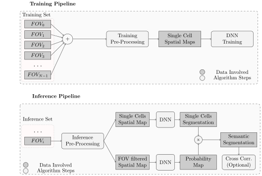

## Astro3S step by step notebooks
This software is composed by 2 pipelines named training and inference.

Astro3S hyperparameters are optimized on the training set pre-processed. Set_parameters, Training_Pipeline_PP and Training_PIpeline_Training_DNN are the notebooks where Training procedure is described. 

- Set_parameters: in this notebook it is described how to set all the hyperparameters of Astro3S using the training set 
- Training_Pipeline_PP: in this notebook it is described how to perform the preprocessing of training pipeline in Astro3S
- Training_Pipeline_Training_DNN: in this notebook it is described how to train the DNN

The inference pipeline comprises three main blocks - pre-processing, semantic segmentation, 
and subcellular cross-correlation analysis - allowing an unbiased end-to-end characterization of the complex morphological and dynamical properties of astrocytes.  

- Inference_Pipeline: In this notebook it is described how to perform AstroSS inference on the inference dataset
- CC_Pipeline: perform sub-cellular cross-correlation analysis on detected astrocytes

### Pre-processing modules results

### Segmentation Results
| Semantic Segmentation      | 
|:------------:|
|   |

|Single cell Details|
|:------------------:|
|   |

### Cross Correlation analysis Results

