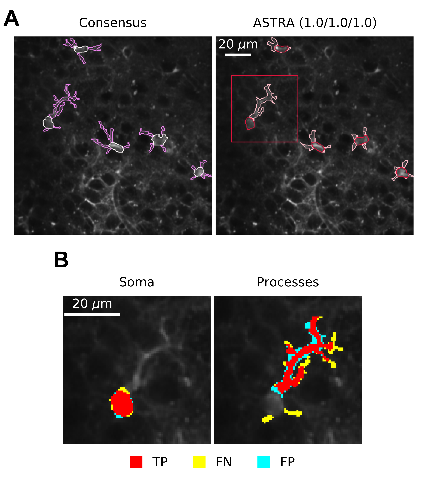
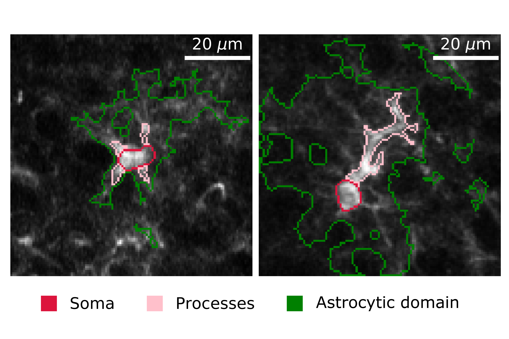
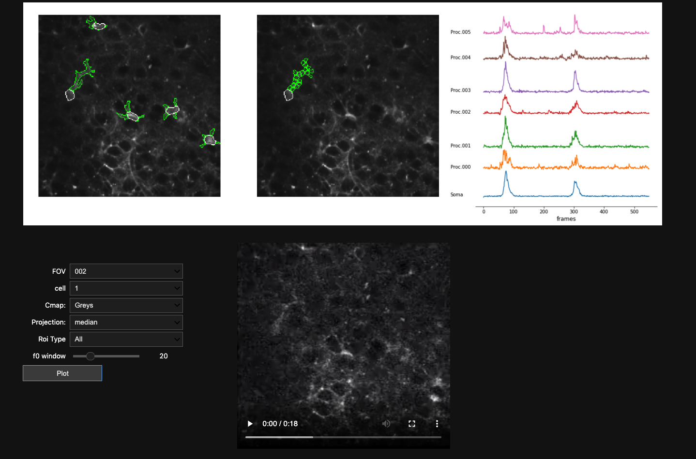

## RASTA step by step notebooks
This software is composed by 2 pipelines named training and inference.

RASTA hyperparameters are optimized on the training set pre-processed. Set_parameters, Training_Pipeline_PP and Training_PIpeline_Training_DNN are the notebooks where Training procedure is described. 

- Set_parameters: in this notebook it is described how to set all the hyperparameters of RASTA using the training set 
- Training_Pipeline_PP: in this notebook it is described how to perform the preprocessing of training pipeline in RASTA
- Training_Pipeline_Training_DNN: in this notebook it is described how to train the DNN

The inference pipeline comprises three main blocks - pre-processing, semantic segmentation, 
and subcellular cross-correlation analysis - allowing an unbiased end-to-end characterization of the complex morphological and dynamical properties of astrocytes.  

- Setup_Activity_Map: In this notebook there is a guide for checking the activity map generator module parameters (steps for patches generations, blocks and threads for the GPU)
- Inference_Pipeline: In this notebook it is described how to perform RASTA inference on the inference dataset
- CC_Pipeline: perform sub-cellular cross-correlation analysis on detected astrocytes

### Pre-processing modules results

### Segmentation Results
| Semantic Segmentation and single cells details| 
|:------------:|
|   |

### Cross Correlation analysis Results

### GUI for ROIs visualization and signal extraction
In Inference_Pipeline.ipynb and CC_Pipeline.ipynb notebooks we added a GUI for ROIs visualization and signal extraction embedded in jupyter.
In the GUI there are:
- Original video
- All ROIs extracted or eventually a selected single cell ROIs overlayed on median projection of the recording
- Signal extracted from a selected cell

